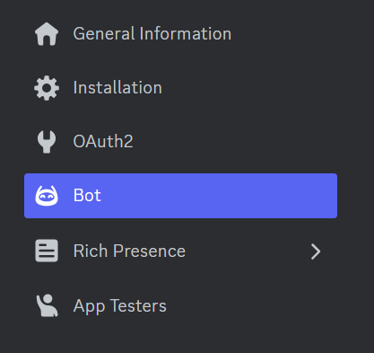
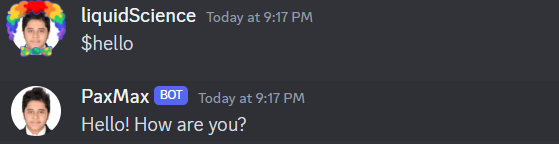

## What is Discord.py?
Many of you who have clicked on this are likely familiar with Discord, but for those who aren't Discord is a free social media platform that allows users to communicate through text, voice, video, and media, It is particularly popular among gamers due to its wide range of features like low-latency voice chat, easy server creation for communities, and integrations with various gaming services. Discord offers a brand new way of bringing together a like minded community under a single server, where people can discuss, connect and share. These servers can have thousands of members, and managing them is not an easy task. Moderating such huge numbers required automation, and hence BOTs came into existence which utilized [Discord API](https://discord.com/developers/docs/intro), the first BOT was Airhorn Solution 'BEEP BOOP' YES! its exactly what it did, it is a simple bot but it opened a door for millions of possibilites. Today Discord Bots can handle almost everything in the server, the admin and moderators can catch a breathe all thanks to the number of bots out there. Today we will be looking at how to create a simple discord bot, using [Discord.py](https://piptrends.com/package/discord.py).

## Background
Before we get started, It is important to clarify some points about Discord.py. While there was a period when development on discord.py was paused, it was revived shortly and is now stable. Despite this hiatus, discord.py remains the most widely used framework for creating Discord bots, other alternatives being [py-cord](https://piptrends.com/package/py-cord), [nextcord](https://piptrends.com/package/nextcord), [hikari](https://piptrends.com/package/hikari). You can check the comparison between these [here](https://piptrends.com/compare/discord.py-vs-nextcord-vs-py-cord-vs-hikari).

## Getting Started

discord.py works with Python 3.8 or higher. Support for earlier versions of Python is not provided. Python 2.7 or lower is not supported. Python 3.7 or lower is not supported.

Before setting up the environment and start building, there is something we need to do. Every bot in discord is recognized by a unique token. This is secret key which is essentially like the bot's password.Creating a Discord Bot account is a straightforward process :
- Open [Discord Developers Portal](https://discord.com/developers/docs/intro)
- Select Applications from the sidebar
<div style="display: flex; justify-content: center;">
    
</div>
- Click on 'New Application'
<div style="display: flex; justify-content: center;">
    
</div>
- Give a nice name for your application, and by agreeing to the terms click on Create
<div style="display: flex; justify-content: center;">
    
</div>
- Now you will be presented with what we can call the 'Home Page' of your bot
- Here you can check out different things and personalize your bot
- In the sidebar click on Bot
<div style="display: flex; justify-content: center;">
    
</div>
- You will see a reset token option, click on it, your unique bot token will be visible to you
<div style="display: flex; justify-content: center;">
    
</div>
> ##### Note:
>Do not share this token with anyone. Exposure of this token could lead to unauthorized access and compromise of sensitive information

Now that we are all set, let us dive right into building our discord bot.

First and foremost let us install discord.py

```bash
python3 -m pip install -U discord.py
```

To get voice support also, we should run : 
```bash
python3 -m pip install -U discord.py[voice]
```

discord.py revolves around the concept of events. An event is something you listen to and then respond to. 
For example, when a message happens, you will receive an event about it that you can respond to.

We will understand better, as we build the bot. Let us begin my importing discord.py

```python
import discord
from dotenv import load_dotenv

load_dotenv()
```
we can store our secret token in `.env` and import and load it as above


As mentioned above, discord revolved around listening and responding to events. These events are controlled by Intents, intents allow bot developers to subscribe to events. We can choose to enable all intents or to enable only specific intents that our bot requires. 

```python
client = discord.Bot(intents=discord.Intents.all())
```
The above snippet, lets us enable all the intents, however it is adviced to enable the intents if you need them. These intents give your bot access to quite sensitive information about the users in your guild. Below is an example of enabling specific intents

```python
client = discord.Bot(intents=discord.intents.members(bans=True, guilds=True))
```
This enables the bot to know about the presence of members of the guild, the information of the banned members of the server. But in this article we shall enable all intents. For future reference you can check [Discord.Intents](https://discordpy.readthedocs.io/en/stable/api.html?highlight=intents#discord.Intents).

In discord commands can be executed by prefix or using slash. Back in the days adding prefix was the only way to do it, but slash commands is considered the standard today. Let us initialize `$` as the prefix to our bot. This means anything that is preceeded with a `$` sign shall be considered as a command by the bot.

```python

client = discord.Bot(command_prefix = '$',intents=discord.Intents.all())
```

```python
@client.event
async def on_ready():
    print(f'Logged in as {client.user} (ID: {client.user.id})')

if __name__ == '__main__':        
    print("Intializing...")
    Bot_Token = os.environ.get('BOT_TOKEN') # assuming you have initalized your secret token in the .env to BOT_TOKEN
    client.run(Bot_Token)
```

The output will be:
>- Intializing...
>- 2024-04-07 20:46:18 INFO     discord.client logging in using static token
>- 2024-04-07 20:46:20 INFO     discord.gateway Shard ID None has connected to Gateway (Session ID: 828d0debdd2da34092017af72b23712c).
>- Logged in as PaxMax#1657 (ID: 1197219481617973258)

We have succesfully logged into our bot. Now we can start writing various commands according to our requirements.

Let us write a simple command that greets us whenever we call it.
```python
    @client.command()
    async def hello(ctx):
        await ctx.send("Hello! How are you ?")
```
We have defined everything, but we are missing something, To see our bot in action we have to add the bot to our server.
We go back to discord developer portal, in application section after selecting our bot, Select OAuth2 in the sidebar, now scroll down and select 'bot' and 'application.commands' in the list of options available, below you can select the permissions you want the bot to have over your server, let us select administrator for now. Click on `COPY` button located at the end of the page.
This will copy the URL, you can paste it in your browser and it will redirect you to an interface where you can select the server you want the bot to be added to, Click on "Continue" and Authorize. This will successfully add our bot to the server, now we can see it action.

Let us call the hello command by typing $hello
<div style="display: flex; justify-content: center;">
    
</div>
Congratulations! We have successfully run our first discord command.

Another example is where we do not require the call the command exclusively, instead it is called when a event is triggered
```python
@client.event
async def on_message(message):
    if message.content == 'kill':
        await message.channel.send('Restricted Word, Please refrain from using it')
```
This event acts as a filter that takes in message as the argument and if it is a restricted word, it issues a warning.
<div style="display: flex; justify-content: center;">
    
</div>


## Commands
Commands are the building blocks of a bot, we can create as many commands as we want, based on our use case. A command must always have at least one parameter, ctx, which is the Context.
There are two ways of registering a command :
The first one is by using client.command() decorator. The second is using the command() decorator followed by Bot.add_command() on the instance.
Example :
```python
@client.command()
async def test(ctx):
    pass

# or:

@commands.command()
async def test(ctx):
    pass

bot.add_command(test)
```
> ##### Note:
> Any parameter that is accepted by the Command constructor can be passed into the decorator. For example, to change the name to something other than the function would be as simple as doing this
> ```python
>@client.command(name='list')
>async def _list(ctx, arg):
>    pass
>```

## Cogs
As the number of commands increase, your main.py becomes huge and it becomes inefficient and ugly to manage the bot. Cogs is a concept of grouping commands with a similar concept or functioning for a common goal, for example, all the moderation commands can be grouped together, all the commands related to voice channels can be grouped together in another file. Now we will see how to define and sync commands after grouping them.

First let us create a folder cogs and create the categories.
<div style="display: flex; justify-content: center;">
    
</div>
> ##### Note:
> your categories may differ based on your requirement, this is just defining the structure

Defining commands in cogs is very similar to what we were doing earlier, only difference is here we use classes.

```python
#In Greetings.py
import discord
from discord.ext import commands

class Greetings(commands.Cog):
    def __init__(self, client):
        self.client = client

    #this is how we define a command inside cogs      
    @commands.command()
    async def hello(self, ctx):
        await ctx.send("Hello ! How are you")
    
    #this is how we wait for a condition to be met for a event is triggered 
    @commands.Cog.listener()
    async def on_member_join(self,ctx):
        embed = discord.Embed(title = ctx.display_name,color = 0x4dff4d)
        embed.set_thumbnail(url = ctx.avatar)
        embed.set_image(url='https://media.giphy.com/media/v1.Y2lkPTc5MGI3NjExN284ZDdraXloczdkOTUwcTU2dGtudGttb2VscDAwbTVndTh2YTVvdCZlcD12MV9pbnRlcm5hbF9naWZfYnlfaWQmY3Q9Zw/l4FGpPki5v2Bcd6Ss/giphy-downsized-large.gif')
        embed.add_field(name = 'Joined Server',value=f'{discord.utils.format_dt(ctx.joined_at)}',inline=True)
        embed.add_field(name = 'Joined Discord',value=f'{discord.utils.format_dt(ctx.created_at)}',inline=True)
        channel = self.client.get_channel(1210901142989447188)
        await channel.send(embed = embed )
    #The above command creates an embed whenever a new member joins the server and redirects the message to a specific channel, defined by the channel ID, you can get the channel ID by viewing the channel info

async def setup(client):
    await client.add_cog(Greetings(client))
#this adds the cog to the discord client
```
By doing this we have built the foundation with cogs, Next step: registering commands in main.py

```python
import discord
from discord.ext import commands
import os
from dotenv import load_dotenv

load_dotenv()
client = commands.Bot(command_prefix = '$',intents=discord.Intents.all())

@client.event
async def on_ready():
    await client.change_presence(status = discord.Status.dnd, activity=discord.Game('Building!')) # You might have noticed the activity status of some bots, this is used to change it and modify it as we want.
    await load_extensions()
    print("PaxMax is functioning properly!!!")
    print('---------------------------------')
    print(f"User : {client.user} (ID : {client.user.id})")

    try :
        synced = await client.tree.sync()
        print(f'Synced {len(synced)} commands')
    except Exception as e:
        print(e)

async def load_extensions():
    print("Loading extensions...")
    for filename in os.listdir('./cogs'):
        if filename.endswith('.py'):
            await client.load_extension(f'cogs.{filename[:-3]}')
            print(f"Loaded Cog: {filename[:-3]}")
        else:
            print("Unable to load cog.")
              
if __name__ == '__main__':        
    print("Initializing...")
    Bot_Token = os.environ.get('BOT_TOKEN')
    client.run(Bot_Token)
   
```
Congratulations!! You have successfully registered all the commands.

By adopting cogs, you'll create well-structured, maintainable Discord bots that can scale effectively as you add more features.

## Slash Commands

While cogs provide structure for traditional text commands using prefixes, discord.py version 2 introduces a new interaction paradigm: slash commands, These powerful features offer a more interactive way of interacting with our discord bot.

What is so different about slash commands?
In the traditional way we had to remember all the commands, but with slash commands a simple slash '/' is all we need. They appear directly within the Discord chat window, offering autocomplete suggestions.

Lets us look into the following example:
```python
@client.tree.command(name="hello")
async def test(interaction : discord.Interaction):
    await interaction.response.send_message("How are you?")
```
@client.tree.command: This decorator marks the following function as a slash command.
client: This refers to the Discord bot instance you created (usually named something like client).
name="hello": This specifies the name of the slash command, which will be displayed in the Discord interface. Users will type /hello to trigger this command.

<div style="display: flex; justify-content: center;">
    
</div>

## Moderation

Maintaining a healthy environment in a server is cruicial. Discord bots can play a cruicial role for moderators, offering automated assistance with common tasks. Kick, Ban, Unban are some common moderation commands we can implement in your Discord bot using discord.py

```python
import discord
from discord.ext import commands
from discord.ext.commands import has_permissions, MissingPermissions

class Moderation(commands.Cog):
    def __init__(self, client):
        self.client = client

    @commands.command()
    @has_permissions(kick_members = True)
    async def kick(self, ctx,member: discord.Member, *, reason = None):
        await member.kick(reason = reason)
        await ctx.send(f'User {member} has been kicked')
    @kick.error
    async def kick_error(self, ctx, error):
        if isinstance(error,commands.MissingPermissions):
            await ctx.send("You do not have permissions lil homie")
    
    @commands.command()
    @has_permissions(ban_members = True)
    async def ban(self, ctx, member: discord.Member, *, reason = None):
        await member.ban(reason = reason)
        await ctx.send(f'User {member} has been banned')
    @ban.error
    async def ban_error(ctx, error):
        if isinstance(error,commands.MissingPermissions):
            await ctx.send("You do not have permissions for that lil homie")


    @commands.command()
    @has_permissions(ban_members = True)
    async def unban(self, ctx, *, member_id: int):
        bans = [entry async for entry in ctx.guild.bans(limit=2000)]
        for ban_entry in bans:
            user = ban_entry.user
            if user.id == member_id:
                await ctx.guild.unban(user)
                await ctx.send(f'User {user} has been unbanned.')
                return
            else:
                await ctx.send(f'User with ID {member_id} is not currently banned.')
            
    @unban.error
    async def unban_error(self, ctx, error):
        if isinstance(error, commands.MissingPermissions):
            await ctx.send('You do not have permissions for that lil homie')

async def setup(client):
    await client.add_cog(Moderation(client)) 
```
Here we have defined moderation commands to moderate the users. Kick command is used to kick a user from the server, the command first checks if the user calling this command has the authority to kick the specified user, MissingPermissions handles this.
Ban command is similar to kick, but once a user is banned he cannot join back unless they are unbanned, both of these commands check the permissions of the person calling it.

## Advanced Application
In this article we have laid the basic foundation for the discord bot, but the possibilities are endless, we can work with voice commands, various decorators, error handling, manage members. Discord.py has a very large active community to help you and has a very good documentation to help you achieve your end goal.

## Related Articles

- [Introduction to Discord.py](https://discordpy.readthedocs.io/en/stable/intro.html)
- [Getting Started with examples](https://github.com/Rapptz/discord.py/tree/master/examples)