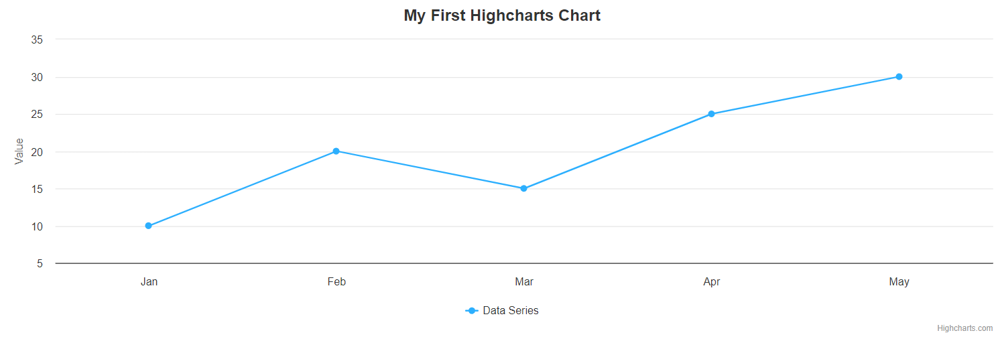
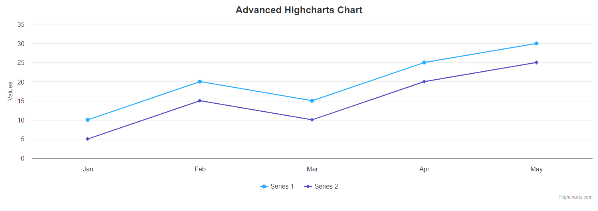
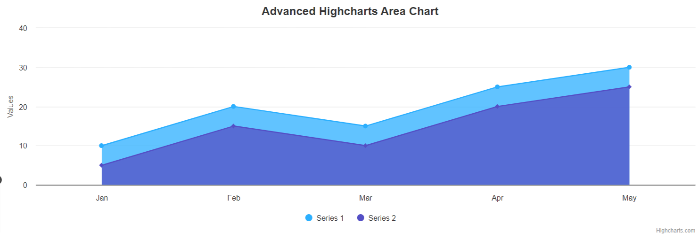
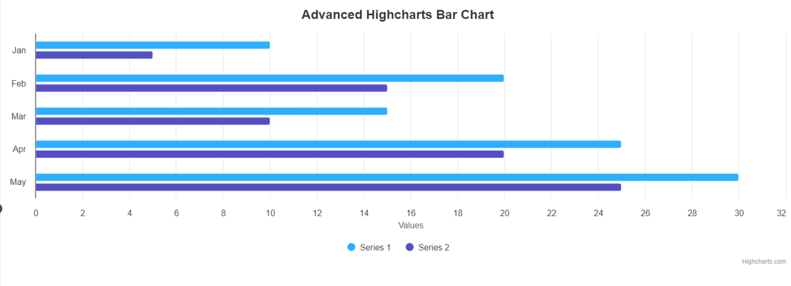
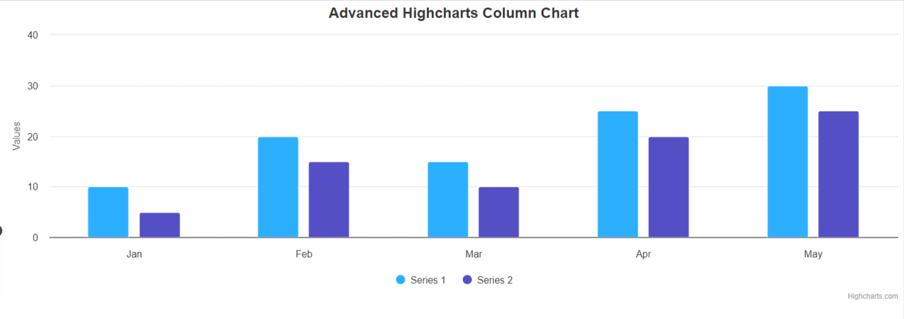
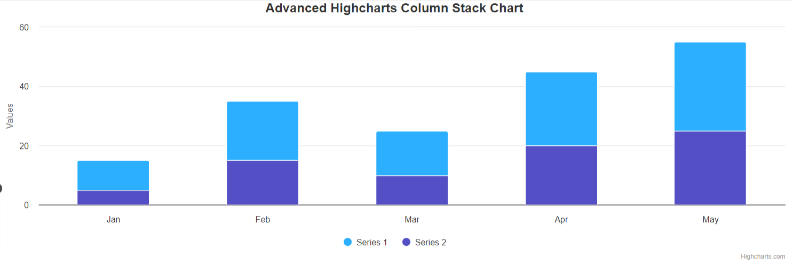

## Introduction 
When we have a large amount of data and want to present it in the best visual format possible, charts and graphs are the best option. Highcharts is a popular library for charts and graphs. It is a java script library. In Python, we have a wrapper for the same. Highcharts generates charts using SVG rendering. High charts can be used to create line charts, area charts, column and bar charts, pie charts, scatter charts, and bubble charts. Simply send the configurations you want, and the chart will be created.

## Installation
 If you want to use the highcharts library in your project, just run below command. It will install all of the required dependencies and make it simple to use in your project. 

```bash
pip install highcharts-core
```

## Basic Usage

It is simple to use once it has been installed. Here's an example of a simple line chart:

```python
import highcharts
chart = highcharts.Highchart()
options = {
    'title': {
        'text': 'My First Highcharts Chart'
    },
    'xAxis': {
        'categories': ['Jan', 'Feb', 'Mar', 'Apr', 'May']
    },
    'yAxis': {
        'title': {
            'text': 'Value'
        }
    },
    'series': [{
        'name': 'Data Series',
        'data': [10, 20, 15, 25, 30]
    }]
}
chart.set_dict_options(options)
chart.save_file('my_chart.html')
```

In this example, we create a basic line chart with specified x-axis categories, y-axis title, and a data series. The resulting chart is saved as an HTML file (`my_chart.html`), which can be opened in any web browser.



## Advanced Features

This library allows you to use a wide range of Highcharts features. You can modify chart types, add annotations, implement drilldowns, and do a lot more. Highcharts by default it will show line charts

```python
# Advanced example with multiple series and customizations
advanced_chart = highcharts.Highchart()

advanced_options = {
    'title': {
        'text': 'Advanced Highcharts Chart'
    },
    'xAxis': {
        'categories': ['Jan', 'Feb', 'Mar', 'Apr', 'May']
    },
    'yAxis': {
        'title': {
            'text': 'Values'
        }
    },
    'series': [{
        'name': 'Series 1',
        'data': [10, 20, 15, 25, 30]
    }, {
        'name': 'Series 2',
        'data': [5, 15, 10, 20, 25]
    }],
    'plotOptions': {
        'column': {
            'stacking': 'normal'
        }
    }
}
advanced_chart.set_dict_options(advanced_options)
advanced_chart.save_file('advanced_chart.html')
```


```python
# Area Chart
advanced_area_chart = highcharts.Highchart()

advanced_area_options = {
    'chart': {
        'type': 'area'
    },
    'title': {
        'text': 'Advanced Highcharts Area Chart'
    },
    'xAxis': {
        'categories': ['Jan', 'Feb', 'Mar', 'Apr', 'May']
    },
    'yAxis': {
        'title': {
            'text': 'Values'
        }
    },
    'series': [{
        'name': 'Series 1',
        'data': [10, 20, 15, 25, 30]
    }, {
        'name': 'Series 2',
        'data': [5, 15, 10, 20, 25]
    }],
    'plotOptions': {
        'column': {
            'stacking': 'normal'
        }
    }
}
advanced_area_chart.set_dict_options(advanced_area_options)
advanced_area_chart.save_file('advanced_area_chart.html')
```


```python
# Bar Chart
advanced_bar_chart = highcharts.Highchart()

advanced_bar_options = {
    'chart': {
        'type': 'bar'
    },
    'title': {
        'text': 'Advanced Highcharts Bar Chart'
    },
    'xAxis': {
        'categories': ['Jan', 'Feb', 'Mar', 'Apr', 'May']
    },
    'yAxis': {
        'title': {
            'text': 'Values'
        }
    },
    'series': [{
        'name': 'Series 1',
        'data': [10, 20, 15, 25, 30]
    }, {
        'name': 'Series 2',
        'data': [5, 15, 10, 20, 25]
    }]
}
advanced_bar_chart.set_dict_options(advanced_bar_options)
advanced_bar_chart.save_file('advanced_bar_chart.html')
```


```python
# Column Chart
advanced_column_chart = highcharts.Highchart()

advanced_column_options = {
    'chart': {
        'type': 'column'
    },
    'title': {
        'text': 'Advanced Highcharts Column Chart'
    },
    'xAxis': {
        'categories': ['Jan', 'Feb', 'Mar', 'Apr', 'May']
    },
    'yAxis': {
        'title': {
            'text': 'Values'
        }
    },
    'series': [{
        'name': 'Series 1',
        'data': [10, 20, 15, 25, 30]
    }, {
        'name': 'Series 2',
        'data': [5, 15, 10, 20, 25]
    }]
}
advanced_column_chart.set_dict_options(advanced_column_options)
advanced_column_chart.save_file('advanced_column_chart.html')
```


```python
# Column Stack Chart
advanced_column_stack_chart = highcharts.Highchart()

advanced_column_stack_options = {
    'chart': {
        'type': 'column'
    },
    'title': {
        'text': 'Advanced Highcharts Column Stack Chart'
    },
    'xAxis': {
        'categories': ['Jan', 'Feb', 'Mar', 'Apr', 'May']
    },
    'yAxis': {
        'title': {
            'text': 'Values'
        }
    },
    'series': [{
        'name': 'Series 1',
        'data': [10, 20, 15, 25, 30]
    }, {
        'name': 'Series 2',
        'data': [5, 15, 10, 20, 25]
    }]
}
advanced_column_stack_chart.set_dict_options(advanced_column_stack_options)
advanced_column_stack_chart.save_file('advanced_column_stack_chart.html')
```



## Options
`chart` > `type` : Specifies the type of the chart eg: line, bar, area, column etc.,
`text`: Specifies the title of the chart.  
`xAxis` > `categories`: Defines the categories (labels) for the X-axis. In this example, the X-axis will have categories 'Jan', 'Feb', 'Mar', 'Apr', and 'May'.  
`yAxis` > `title`: Specifies the title of the Y-axis.  
`series`:This is an array of series objects. Each series object represents a set of data to be plotted on the chart.  
`name`: The name of the series.  
`data`: An array of data points for the series.  
`plotOptions`: Allows you to set options that are common to all plot options (series types).In this example, it is used to configure the column chart options.  
`column`: Specifies that the configuration is for the column chart type.  
`stacking`: Sets the stacking option for the column chart. In this case, it's set to 'normal', meaning the columns are stacked on top of each other.  

## Extended Libraries 
[For Stocks charts](https://www.highcharts.com/products/stock/){:target="_blank"}: ```pip install highcharts-stocks```  
[For Maps charts](https://www.highcharts.com/products/maps/){:target="_blank"}:```pip install highcharts-maps```  
[For Gantt charts](https://www.highcharts.com/products/gantt/){:target="_blank"}:```pip install highcharts-gantt```  

## Demo Url
[https://www.highcharts.com/demo](https://www.highcharts.com/demo){:target="_blank"}