## Data Visualization

Data visualization is the graphical representation of information and data using visual elements like charts, and graphs. Data visualization tools provide an accessible way to see and understand trends, outliers, and patterns in data. The importance of data visualization is simple: it helps people see, interact with, and better understand data.

## Introduction to PyPlot

matplotlib is a Python library that provides many interfaces and functionalities for 2D-graphics similar to [MATLAB's](https://www.mathworks.com/products/matlab.html){:target="\_blank"} in various forms. In short, you can call matplotlib as a high quality plotting library of Python.

PyPlot is a collection of methods within matplotlib which allow user to construct 2D plots easily and interactively.

## Installing and Importing matplotlib

To install matplotlib, simply open your terminal or command prompt and enter the following command:

```bash
pip install matplotlib
```

After successful installation, you can import matplotlib's PyPlot module into your Python script or environment:

```python
import matplotlib.pyplot as plt
```

This allows you to access PyPlot's functionalities by using the `plt` alias, making it easier to create plots and customize visualizations.

## Some Basics

Some commonly used chart types are -

1. Line Chart - A line chart shows information using dots connected by lines, useful for displaying trends over time.
2. Bar Chart - A bar chart represents data with bars of different lengths, helpful for comparing values between categories.
3. Pie Chart - A pie chart displays data in a circular graph, divided into slices to show how parts relate to the whole.
<div style="display: flex; justify-content: center;">
    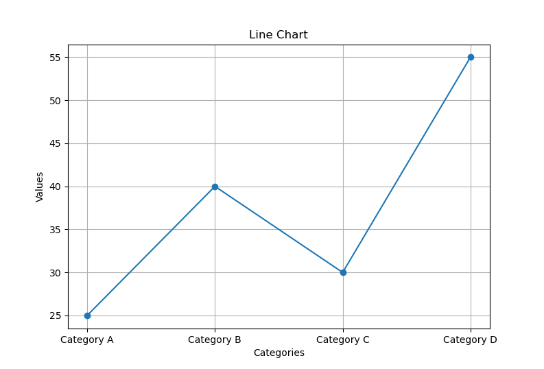
    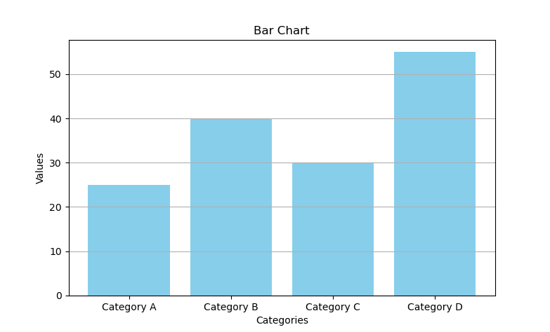
    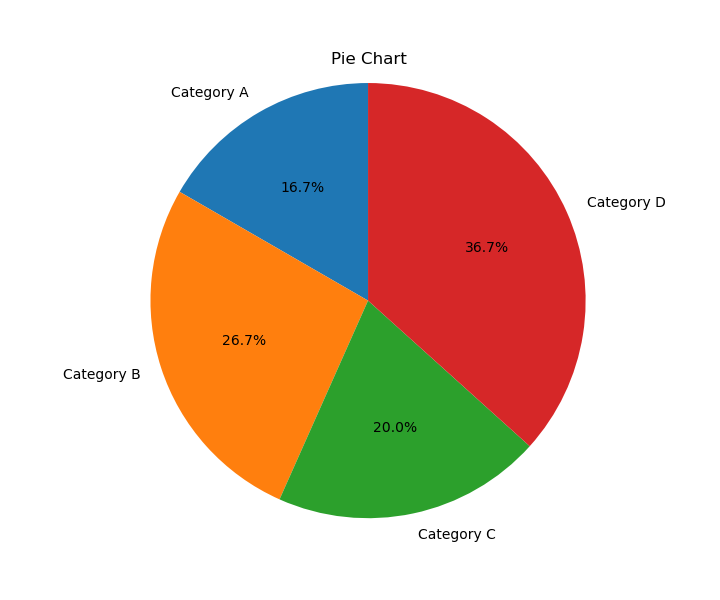
</div>

## Line Chart

A line chart displays information as a series of data points called markers connected by straight line segments. Line charts are particularly useful for visualizing trends and changes over continuous data sets or time intervals. For example - stock market analysis, temperature variations, sales trends, population growth, website traffic etc.

PyPlot's plt() function is used to plot line charts. You can do this as follows:

```python
import matplotlib.pyplot as plt

# Sample data
x_values = [1, 2, 3, 4, 5]
y_values = [2, 4, 6, 8, 10]

# Plotting the line chart
plt.plot(x_values, y_values)

# Show the plot
plt.show()
```

This will open a new window with your plot.

<center>
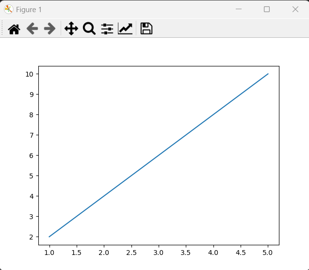
</center>

### Customizing the plot

The full syntax of the plot() function is:

```python
plot( <x-values> [, <y-values>] ... [, <color>]) [, <linewidth>] [, <linestyle>] [, <marker>] )
```

_where_

- **x_values, y_values** are the sequences of values representing the x and y axes respectively.
- **color** defines the color for the plot.
- **linewidth** (float) defines the width of the line.
- **linestyle** defines the style of the line. Options include 'solid', 'dashed', 'dotted', or 'dashdot'.
- **marker**: defines the marker symbol for data points on the line. Examples include 'o' for circles, 's' for squares, and 'd' for diamonds.

#### Color Code

| Character | Color | Character | Color   | Character | Color |
| --------- | ----- | --------- | ------- | --------- | ----- |
| 'b'       | blue  | 'm'       | magenta | 'c'       | cyan  |
| 'g'       | green | 'y'       | yellow  | 'w'       | white |
| 'r'       | red   | 'k'       | black   |           |       |

In addition you can also specify colors in many other ways, including full color names(e.g. "red", "green" etc.), HEX strings ("#ABABAB") etc.

Note that even if you skip specifying color in the plot() function, Python will plot multiple lines in the same plot with different colors but these colors will be decided internally by Python.

```python
import matplotlib.pyplot as plt

# Data
x = [1, 2, 3, 4, 5]
y1 = [10, 15, 13, 18, 20]
y2 = [2, 4, 6, 8, 10]
y3 = [2, 3, 5, 7, 11]
y4 = [1, 2, 3, 4, 5]

# Using abbreviation 'b' for blue
plt.plot(x, y1, color='b')

# Using full name "green" for green
plt.plot(x, y2, color='green')

# Using HEX string "#FF5733" for a specific shade
plt.plot(x, y3, color='#FF5733')

# Not specifying color
plt.plot(x, y4)

# Show the plot
plt.show()
```

Plot -

<center>
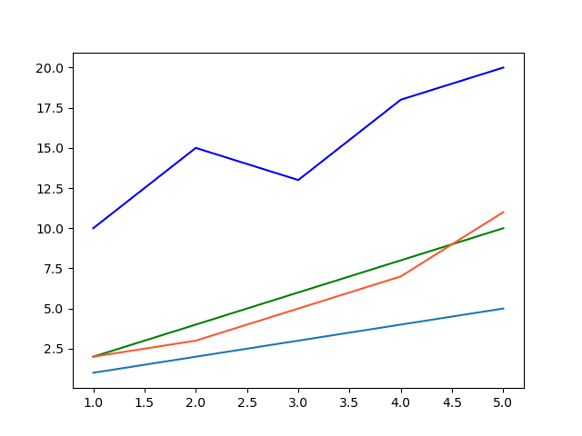
</center>

#### Line width and Line style

To change the Line width, you can set the `linewidth` parameter in the `plot()` function, where you have to specify the width value in float.

Similarly for line style, you can set the `linestyle` or `ls` parameter in the `plot()` function. The available choices for linstyle are "solid", "dashed", "dotted" and "dashdot".

```python
import matplotlib.pyplot as plt

# Data
x = [1, 2, 3, 4, 5]
y1 = [10, 15, 13, 18, 20]
y2 = [2, 4, 6, 8, 10]
y3 = [2, 3, 5, 7, 11]
y4 = [1, 2, 3, 4, 5]

# Plotting with different line styles
plt.plot(x, y1, linestyle='solid', linewidth=2.5)  # Solid line
plt.plot(x, y2, linestyle='dashed', linewidth=3)  # Dashed line
plt.plot(x, y3, linestyle='dotted', linewidth=1.8)  # Dotted line
plt.plot(x, y4, linestyle='dashdot', linewidth=0.5)  # Dash-dot line

# Show the plot
plt.show()
```

Plot -

<center>
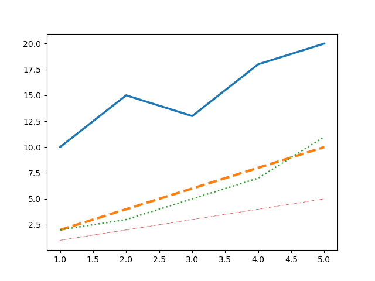
</center>

#### Marker Type

To change the marker type, you can give the following additional arguments in the `plot()` function: `marker = <valid marker type>`

| Marker | Description    | Marker | Description  | Marker | Description   |
| ------ | -------------- | ------ | ------------ | ------ | ------------- |
| "."    | point          | ","    | pixel        | "o"    | circle        |
| "v"    | triangle_down  | "^"    | triangle_up  | "<"    | triangle_left |
| ">"    | triangle_right | "1"    | tri_down     | "3"    | tri_left      |
| "4"    | tri_right      | "2"    | tri_up       | "8"    | octagon       |
| "s"    | square         | "p"    | pentagon     | "P"    | plus (filled) |
| "\*"   | star           | "h"    | hexagon1     | "H"    | hexagon2      |
| "+"    | plus           | "x"    | x            | "X"    | x (filled)    |
| "D"    | diamond        | "d"    | thin_diamond | "\|"   | vline         |
| "\_"   | hline          |        |              |        |               |

```python
import matplotlib.pyplot as plt

# Data
x = [1, 2, 3, 4, 5]
y1 = [10, 15, 13, 18, 20]
y2 = [2, 4, 6, 8, 10]
y3 = [2, 3, 5, 7, 11]
y4 = [1, 2, 3, 4, 5]

plt.scatter(x, y1, marker='o')
plt.scatter(x, y2, marker='^')
plt.scatter(x, y3, marker='s')
plt.scatter(x, y4, marker='d')

# Show the plot
plt.show()
```

Plot -

<center>
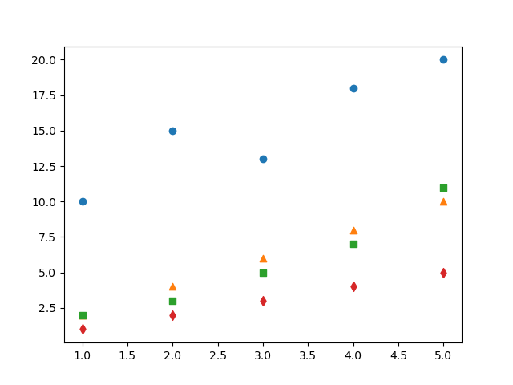
</center>

## Bar Chart

A bar chart displays information using bars of different heights. Bar charts are commonly used for visualizing categorical data and comparing quantities among different categories. For example - sales comparison, market share analysis, population distribution, survey results, etc.

PyPlot's bar() function is used to plot bar charts. You can do this as follows:

```python
import matplotlib.pyplot as plt

# Sample data
categories = ['Category A', 'Category B', 'Category C', 'Category D']
values = [30, 50, 40, 60]

# Creating a bar chart
plt.bar(categories, values)

# Show the plot
plt.show()
```

This will open a new window with your plot.

<center>
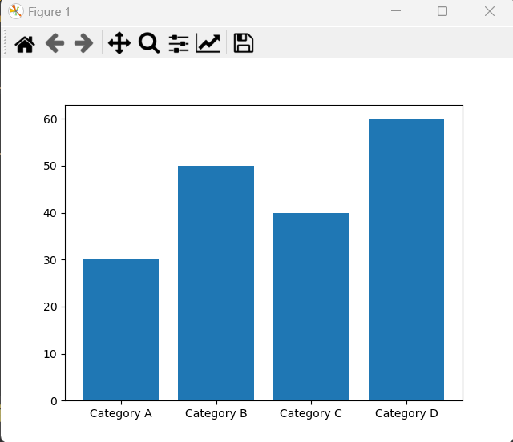
</center>

### Customizing the bars

The full syntax of the bar() function is:

```python
bar( <x-sequence>, <y-sequence> ... [, <width>]) [, <color>] )
```

_where_

- **x-sequence, y-sequence** are the sequences of values representing the x and y axes respectively.
- **width** (float/sequence) defines the width of the bars.
- **color** (single/sequence): defines the color of the bars.

#### Width

You can either specify different width(other than the default) for all bars, or you can specify different widths for different bars of the bar chart using the `width` argument. For same width for all bars, you can specify a point value as the value for the `width` argument or for different widths you can specify a sequence value as the value for the `width` argument.

Same Width -

```python
import matplotlib.pyplot as plt

# Sample data
categories = ['Category A', 'Category B', 'Category C', 'Category D']
values = [30, 50, 40, 60]

# Creating a bar chart
plt.bar(categories, values, width = 0.3)

# Show the plot
plt.show()
```

Chart -

<center>
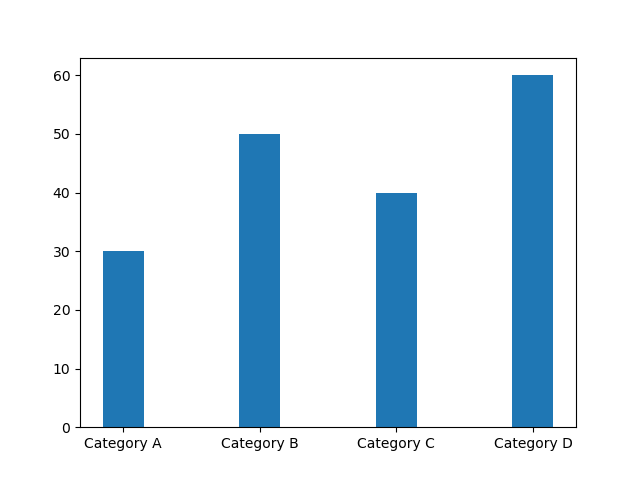
</center>

Different Widths -

```python
import matplotlib.pyplot as plt

# Sample data
categories = ['Category A', 'Category B', 'Category C', 'Category D']
values = [30, 50, 40, 60]
width = [0.5, 0.6, 0.7, 0.8]

# Creating a bar chart
plt.bar(categories, values, width = width)

# Show the plot
plt.show()
```

Chart -

<center>
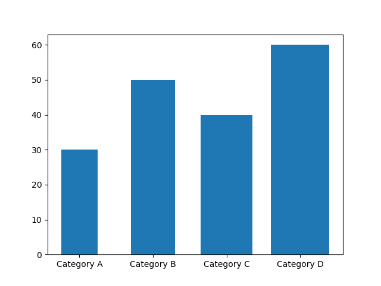
</center>

#### Color

Similar to the `width` argument, you can also specify the `color` argument for the bars.

Same Color -

```python
import matplotlib.pyplot as plt

# Sample data
categories = ['Category A', 'Category B', 'Category C', 'Category D']
values = [30, 50, 40, 60]

# Creating a bar chart
plt.bar(categories, values, color = "g")

# Show the plot
plt.show()
```

Chart -

<center>
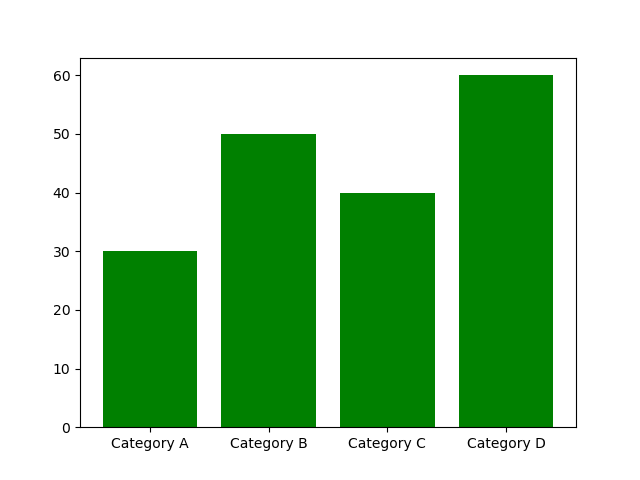
</center>

Different Colors -

```python
import matplotlib.pyplot as plt

# Sample data
categories = ['Category A', 'Category B', 'Category C', 'Category D']
values = [30, 50, 40, 60]
colors = ["r", "yellow", "#abcd90", "black"]

# Creating a bar chart
plt.bar(categories, values, color = colors)

# Show the plot
plt.show()
```

Chart -

<center>
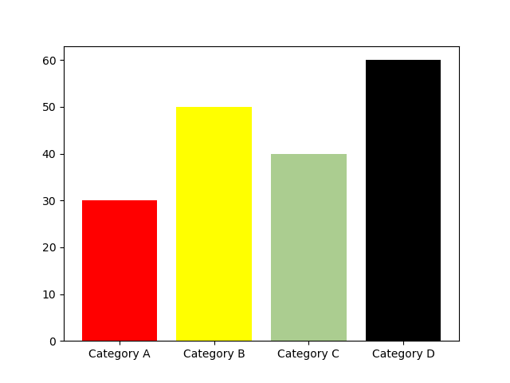
</center>

### Multiple Bar Charts

Creating multiple bar charts in the same figure allows for easy comparison between different datasets across the same categories or groups. This can be achieved by adjusting the positions of the bars for each dataset.

```python
import matplotlib.pyplot as plt
import numpy as np

# Sample data for two sets of bars
categories = ['Category A', 'Category B', 'Category C', 'Category D']
values_set1 = [30, 50, 40, 60]
values_set2 = [45, 55, 35, 75]

# Set the width of the bars and the positions
bar_width = 0.35
bar_positions_set1 = np.arange(len(categories))
bar_positions_set2 = [x + bar_width for x in bar_positions_set1]

# Creating the bar charts
plt.bar(bar_positions_set1, values_set1, width=bar_width, color='skyblue')
plt.bar(bar_positions_set2, values_set2, width=bar_width, color='salmon')

# Show the plot
plt.show()
```

In the above code snippet `bar_positions_set1` and `bar_positions_set2` define the positions of the bars for the two datasets, ensuring they are displayed side by side.

Chart -

<center>
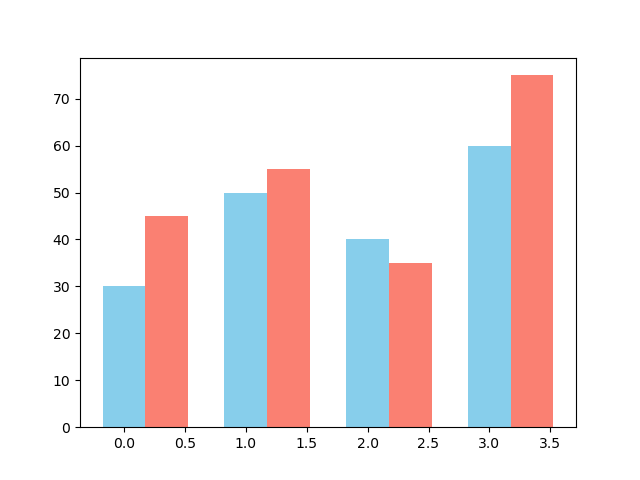
</center>

You can also add labels and titles to this chart to make it more informative. We'll discuss about these in detail in the [Labels and Titles Section](#customizing-the-plot-1)

```python
# Adding labels and title
plt.xlabel('Categories')
plt.ylabel('Values')
plt.title('Comparison of Two Sets of Values by Category')
plt.xticks([x + bar_width / 2 for x in bar_positions_set1], categories)
plt.legend()
```

Chart -

<center>
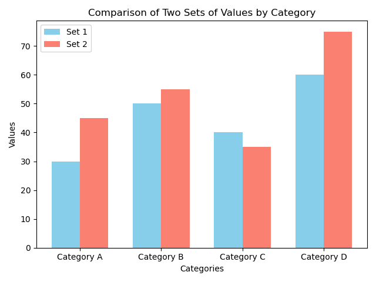
</center>

### Horizontal Bar Charts

Use the `plt.barh()` function to create a horizontal bar chart by passing the `categories` as the y-axis and `values` as the corresponding width of the bars along the x-axis. Adjust the labels, colors, and other parameters just like you would with a normal bar chart using the `plt.bar()` function.

```python
import matplotlib.pyplot as plt

# Sample data
categories = ['Category A', 'Category B', 'Category C', 'Category D']
values = [30, 50, 40, 60]

# Creating a horizontal bar chart
plt.barh(categories, values, color='skyblue')

# Show the plot
plt.show()
```

Chart -

<center>
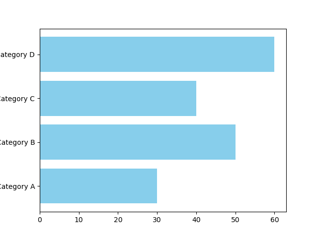
</center>

## Pie Chart

A pie chart divides a circle into slices to illustrate numerical proportions. Each slice represents a portion of the whole, with the size of each slice proportional to the quantity it represents. Pie charts are useful for displaying relative proportions or percentages of a whole. For example - market share analysis, population distribution, survey results, etc.

PyPlot's pie() function is used to plot pie charts. You can use this as follows:

```python
import matplotlib.pyplot as plt

# Sample data
contribution = [17, 8.8, 12.75, 14]

# Creating a pie chart
plt.pie(contribution)

# Show the plot
plt.show()
```

This will open a new window with your plot.

<center>
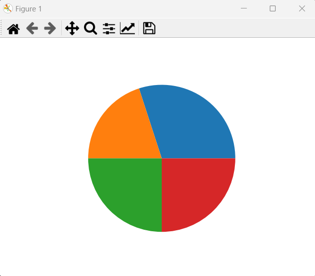
</center>

### Customizing the chart

The full syntax of the pie() function is:

```python
pie( <contribution-sequence> ... [, <labels>] [, <autopct>] [, <colors>] [, <explode>])
```

_where_

- **contribution-sequence** are the sequences of values representing the contribution of each category to the whole.
- **labels** (sequence) defines the labels of the pies.
- **autopct** (format string): defines the format in which the percentage share of each category is added on the pie.
- **colors** (sequence): defines the colors of the pies.
- **explode** (sequence): defines the distance of the pie from the center to emphasize on more slice more than the other.

#### Adding Labels of Slices

The above plot is incomplete as it makes it difficult to make out which slice belongs to what. You can pass the sequence of labels as a value to tha `labels` argument of the `pie()` function.

```python
import matplotlib.pyplot as plt

# Sample data
labels = ['Category A', 'Category B', 'Category C', 'Category D']
sizes = [30, 20, 25, 25]  # Values for each category

# Creating a pie chart
plt.pie(sizes, labels=labels)

# Show the plot
plt.show()
```

Chart -

<center>
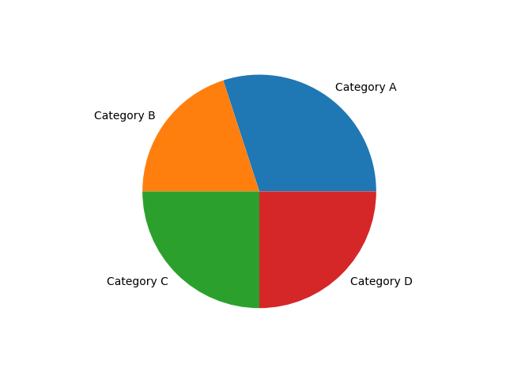
</center>

#### Adding Formatted Slice Percentages

To view the percentage share in a pie chart, you need to add an argument `autopct` with a format string such as `"%1.1F%%"`. It will show the percent share of each slice to the whole, formatted in a certain way.

The percentage of each value plotted is calculated as:

$$ \frac{single value}{sum of all values} \times  100 $$

The format string used with `autopct` will determine the format of the percentage being displayed. The format string begins with the "%" operator, which specifies the format of the percentage value being displayed.
The general syntax for a format placeholder is

```
[flags][width][.precision]type
```

- **%**: The percentage symbol is a special character that signifies that this string is a format specifier.
- **flags**: Optional flags that can modify the formatting. For example, adding a + flag displays both positive and negative numbers with a sign. The most useful flag is 0, which wien specified will pad tha value being displayed woth preceeding zeroes if the digits of the value is less than the width.
- **width**: Specifies the minimum width of the formatted string. It defines the minimum number of characters used to display the percentage.
- **.**: Separates the precision from the width. It indicates the number of digits to display after the decimal point.
- **precision**: Specifies the number of decimal places to display for the percentage.
- **type**: Represents the data type being formatted. For percentages, it is often f for float.
- **%%**: When you include %% in a format string, it serves as an escape sequence for the percentage symbol %. It doesn't represent any data to format; instead, it's used to display a literal percentage sign.

Format strings examples -

| Format String          | Parameters                                                                                 | Description                                                                                                                                                        |
| ---------------------- | ------------------------------------------------------------------------------------------ | ------------------------------------------------------------------------------------------------------------------------------------------------------------------ |
| "%5d", "%5i"           | width = 5, type = d or i (integer type)                                                    | Print the value with 5 characters. If the value being printed is less than 5 characters, it will be padded with leading blanks.                                    |
| "%05d", "%05i"         | flag = 0, width = 5, type = d or i (integer type)                                          | With the flag being set to 0, the value will now be printed with leading zeroes(0) instead of blank spaces.                                                        |
| "%5d%%", "%5i%%"       | width = 5, type = d or i (integer type), percentage sign in the end                        | Adds a % sign to the end of the format string.                                                                                                                     |
| "%05.2f%%", "%05.2F%%" | flag = 0, width = 5, type = f or F (float type), precision = 2, percentage sign in the end | The precision parameter, sets the number of characters that will be displayed after the decimal point. Here, .2 indicates that two decimal places should be shown. |

Here's how you can use the autopct parameter -

```python
import matplotlib.pyplot as plt

# Sample data
labels = ['Category A', 'Category B', 'Category C', 'Category D']
sizes = [30, 20, 25, 25]  # Values for each category

# Creating a pie chart
plt.pie(sizes, labels=labels, autopct='%06.2f%%')

# Show the plot
plt.show()
```

Chart -

<center>
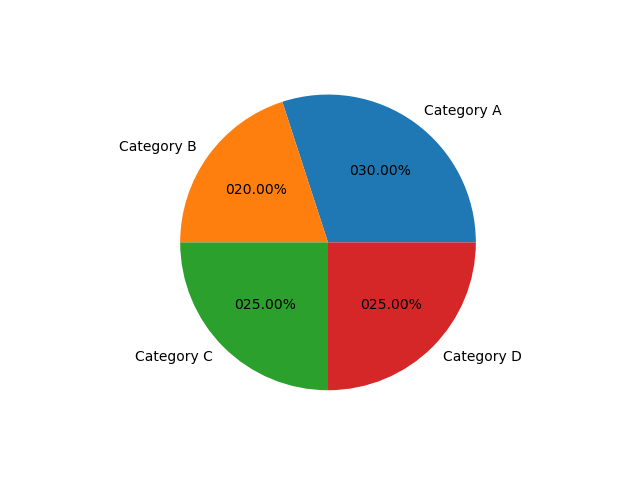
</center>

#### Adding colors to teh slices

You can define different colors to the slices using the `colors` parameter.

```python
import matplotlib.pyplot as plt

# Sample data
labels = ['Category A', 'Category B', 'Category C', 'Category D']
sizes = [30, 20, 25, 25]  # Values for each category
colors = ['skyblue', 'salmon', 'lightgreen', 'gold']

# Creating a pie chart
plt.pie(sizes, labels=labels, colors=colors)

# Show the plot
plt.show()
```

Chart -

<center>
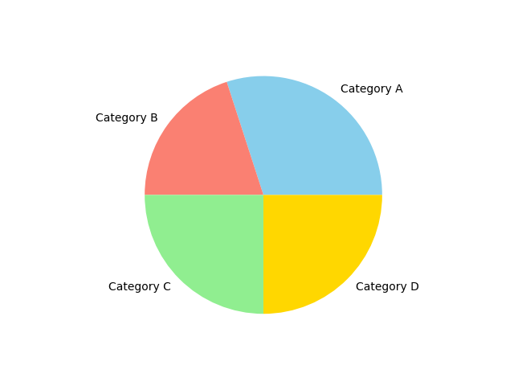
</center>

#### Exploding a slice

When you want to emphasize on one or more slices and show them little pulled out, you can use the `explode` parameter of the `pie()` function

```python
import matplotlib.pyplot as plt

# Sample data
labels = ['Category A', 'Category B', 'Category C', 'Category D']
sizes = [30, 20, 25, 25]  # Values for each category
colors = ['skyblue', 'salmon', 'lightgreen', 'gold']
explode = (0, 0.1, 0, 0)

# Creating a pie chart
plt.pie(sizes, labels=labels, colors=colors, explode=explode, autopct="%06.2f")

# Show the plot
plt.show()
```

Chart -

<center>
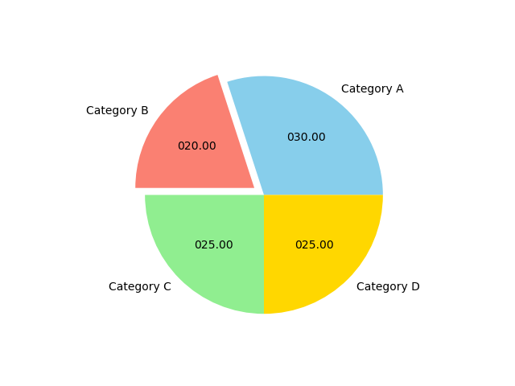
</center>

## Customizing the Plot

Data Visualization demands much more from a graph/plot. The graph or plot should have a proper title, X and Y limits defined, labels, legends etc. All this makes understanding the plot and taking the decisions easier.

### Adding a title

To add a title to your plot, you can use the `title()` function. The general syntax of the function is

```
<matplotlib.pyplot>.title(<title string>)
```

Example -

```python
import matplotlib.pyplot as plt

# Sample data
labels = ['Category A', 'Category B', 'Category C', 'Category D']
sizes = [30, 20, 25, 25]  # Values for each category
colors = ['skyblue', 'salmon', 'lightgreen', 'gold']
explode = (0, 0.1, 0, 0)

# Creating a pie chart
plt.pie(sizes, labels=labels, colors=colors, explode=explode, autopct="%06.2f")

# Adding a title
plt.title("Pie Chart with different colors.")

# Show the plot
plt.show()
```

Chart -

<center>
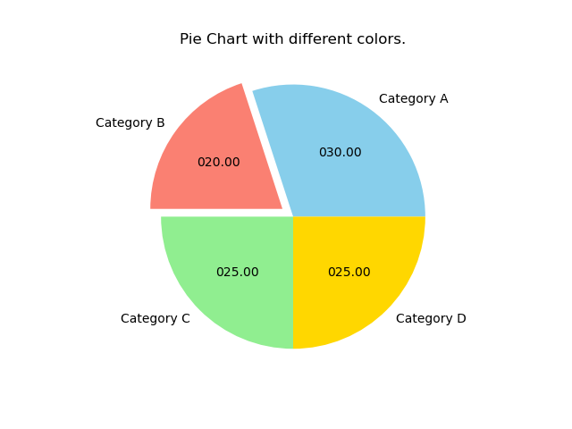
</center>

### Setting X and Y Axes Labels

To add x and y labels to a plot, you can use the `xlabel()` and `ylabel()` functions.
The general syntax for these functions is -

```
<matplotlib.pyplot>.xlabel(<X axis label string>)
<matplotlib.pyplot>.ylabel(<Y axis label string>)
```

Example -

```python
import matplotlib.pyplot as plt

# Sample data
categories = ['Category A', 'Category B', 'Category C', 'Category D']
values = [30, 20, 25, 35]  # Values for each category

# Creating a bar chart
plt.bar(categories, values)

# Adding x and y labels
plt.xlabel('Categories')
plt.ylabel('Values')

# Adding title
plt.title('Bar Chart with X and Y Labels')

# Show the plot
plt.show()
```

Chart -

<center>
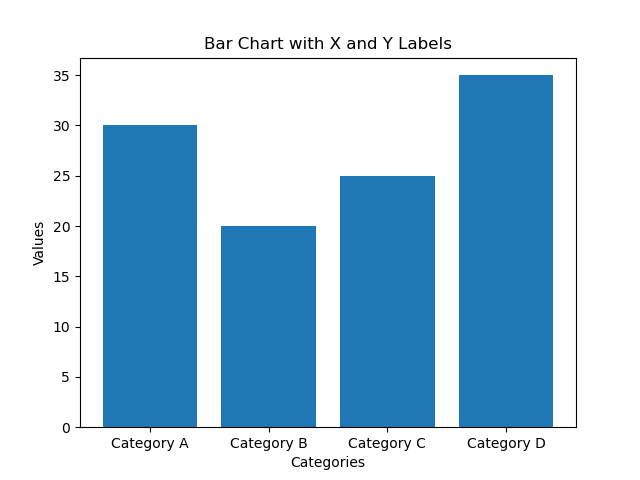
</center>

### Setting X and Y Axes limits

PyPlot automatically picks the best fitting range for X and Y axes by default. But, to have your own limits specified for X and Y axes, t=you can use the `xlim()` and `ylim()` functions.
The general syntax of these functions is:

```
<matplotlib.pyplot>.xlim(<xmin>, <xmax>)
<matplotlib.pyplot>.ylim(<ymin>, <ymax>)
```

Example -

```python
import matplotlib.pyplot as plt

# Sample data
x_values = [1, 2, 3, 4, 5]
y_values = [2, 4, 6, 8, 10]

# Creating a line chart
plt.plot(x_values, y_values)

# Adding x and y labels
plt.xlabel('X Axis')
plt.ylabel('Y Axis')

# Adding title
plt.title('Line Chart with X and Y Limits')

# Setting x and y limits
plt.xlim(1, 5)  # X-axis limits from 1 to 5
plt.ylim(0, 12)  # Y-axis limits from 0 to 12

# Show the plot
plt.show()
```

Chart-

<center>
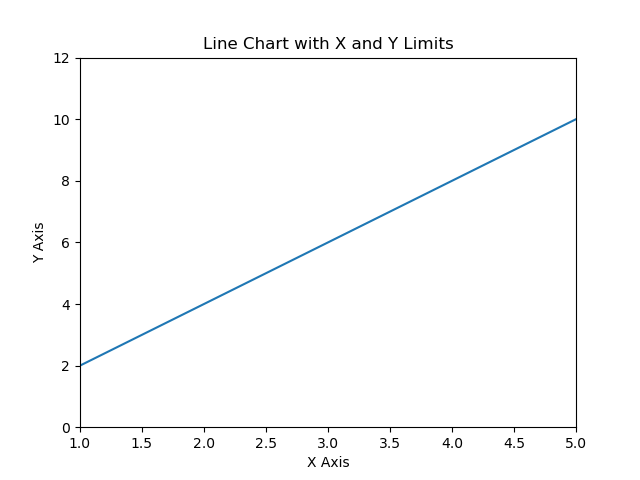
</center>

### Setting X and Y Axes Ticks

Similar to the limits, PyPlot automatically decides the data points that will have ticks on the axes, but to assign your own data points will have tick marks on X and Y axes using the `xticks()` and `yticks()` functions.

The general syntax of these functions is:

```
<matplotlib.pyplot>.xticks(<tick data points sequence>, <tick labels sequence>)
<matplotlib.pyplot>.yticks(<tick data points sequence>, <tick labels sequence>)
```

Example -

```python
import matplotlib.pyplot as plt

# Sample data
categories = ['A', 'B', 'C', 'D']
values = [30, 20, 25, 35]  # Values for each category

# Creating a bar chart
plt.bar(categories, values)

# Adding x and y ticks with labels
plt.xticks(range(len(categories)), categories, rotation=45)  # X-axis ticks with labels
plt.yticks(values)  # Y-axis ticks with labels

# Adding x and y labels
plt.xlabel('Categories')
plt.ylabel('Values')

# Adding title
plt.title('Bar Chart with Custom X and Y Ticks')

# Show the plot
plt.show()
```

Chart-

<center>
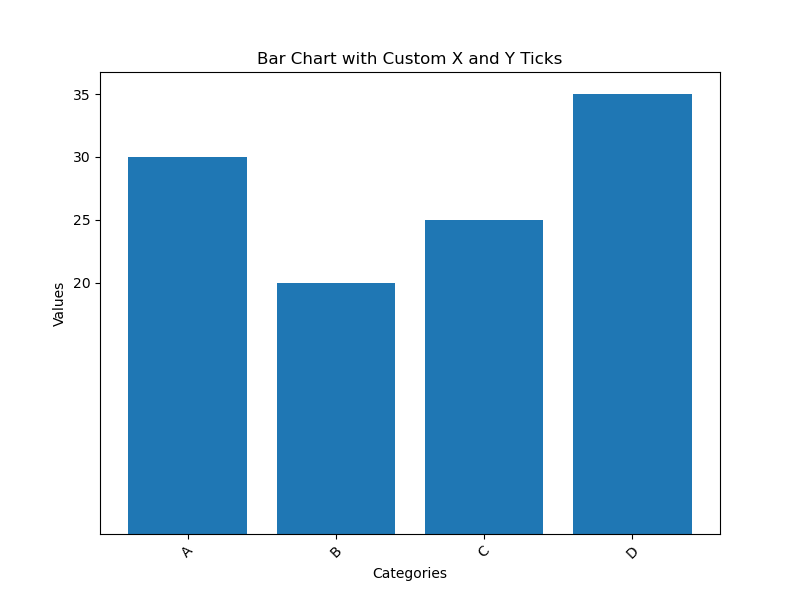
</center>

### Adding legends

To add legends to a line chart with multiple lines representing different data series, you can use the `legend()` function in PyPlot. Make sure, you specify the `label` argument in your plotting function.

The general syntax of the `legend()` function is:

```
<matplotlib.pyplot>.legends(loc = <position number or strings>)
```

Example -

```python
import matplotlib.pyplot as plt

# Sample data
x_values = [1, 2, 3, 4, 5]
y1_values = [2, 4, 6, 8, 10]
y2_values = [1, 3, 5, 7, 9]

# Creating a line chart with multiple lines
plt.plot(x_values, y1_values, label='Line 1')
plt.plot(x_values, y2_values, label='Line 2')

# Adding x and y labels
plt.xlabel('X Axis')
plt.ylabel('Y Axis')

# Adding title
plt.title('Line Chart with Legends')

# Adding legends
plt.legend()

# Show the plot
plt.show()
```

Chart-

<center>
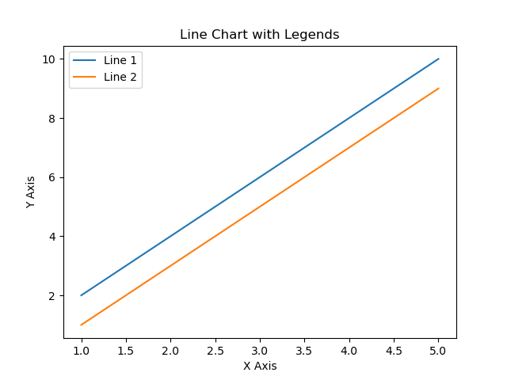
</center>

You can use the `loc` argument to specify the location of the legends in your chart.

```python
import matplotlib.pyplot as plt
import numpy as np

# Sample data
categories = ['Category A', 'Category B', 'Category C', 'Category D']
values_1 = [30, 20, 25, 35]  # Values for bar chart 1
values_2 = [25, 15, 20, 30]  # Values for bar chart 2

bar_width = 0.35  # Width of each bar
x = np.arange(len(categories))  # x locations for the groups

# Creating multiple bar charts
plt.bar(x, values_1, width=bar_width, label='Bar Chart 1')
plt.bar(x + bar_width, values_2, width=bar_width, label='Bar Chart 2')

# Adding x and y labels
plt.xlabel('Categories')
plt.ylabel('Values')

# Adding title
plt.title('Multiple Bar Charts with Legends')

# Adding legends with loc parameter for placement
plt.legend(loc='upper right')

# Setting x-axis ticks positions
plt.xticks(x + bar_width / 2, categories)

# Show the plot
plt.show()
```

Chart -

<center>
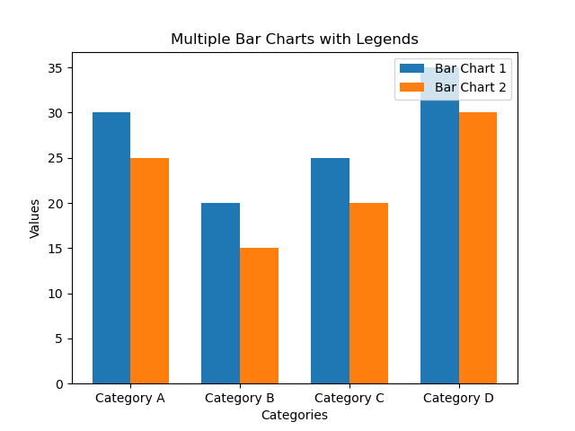
</center>

## Saving a figure

You can save your plot using the `savefig()` function. You can save them in popular formats like _.png_, _.jpg_, _pdf_, etc.

The general syntax of the `savefig()` function is -

```
<matplotlib.pyplot>.savefig(<string with path and filename and extension>)
```

Example -

```python
plt.savefig("filename.png")
plt.savefig("filename.pdf")
```

## Project Ideas

Some project ideas to get started with PyPlot are -

- **Financial Data Analysis**: Create visualizations for stock market data, including stock price movements, trading volumes, and comparative analysis of multiple stocks.
- **Weather Data Visualization**: Develop visualizations for weather patterns, such as temperature trends, rainfall distribution, or climate change analysis using historical weather data.
- **Social Media Analytics**: Analyze and visualize social media trends, user engagement, sentiment analysis, or network graphs using data collected from social media platforms.

In this article, we covered the basics of Data Visualization with PyPlot. We explored Line Charts, Bar Charts, and Pie CHarts in detail. We also discusses the anatomy of a chart and how to save these figures. Armed with this newfound knowledge, learners can use PyPlot and add Data Visualization features to their projects.

## Useful Links

- [pypi - matpotlib](https://pypi.org/project/matplotlib/){:target="\_blank"}
- [matplotlib Documentation](https://matplotlib.org/stable/tutorials/pyplot.html){:target="\_blank"}
- [What Is PyPlot In Matplotlib?](https://www.activestate.com/resources/quick-reads/what-is-pyplot-in-matplotlib/){:target="\_blank"}
- [weschools - PyPlot Tutorial](https://www.w3schools.com/python/matplotlib_pyplot.asp){:target="\_blank"}
