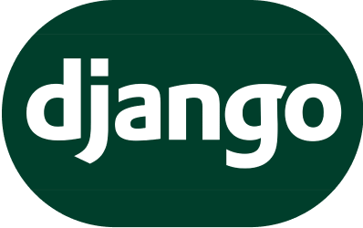

When developing web applications in Python, choosing the right framework can significantly impact your project's success. Flask, Django, and FastAPI are three popular options, each with its own strengths and trade-offs. This article explores these frameworks with practical examples to help you make an informed decision.

## Flask: The Lightweight Framework
<div style="display: flex; justify-content: center;">
    
</div>

### Overview
Flask is a micro-framework designed to be simple, lightweight and flexible. It provides the essentials for web development but lacks several built-in features compared to other frameworks. Flask follows the [MVC (model-view-controller)](https://www.geeksforgeeks.org/mvc-framework-introduction/) architectural pattern and supports Jinja templates, which can be used to create views. Flask is ideal for small to medium-sized projects where you need more control over your application’s components. Flask applications do not have a standardized structure and depend among developers.

### Sample Code

```python
from flask import Flask
 
app = Flask(__name__)
 
 
@app.route("/", methods=["GET"])
def hello():
    return "Hello, World!"

if __name__ == '__main__':
    app.run(debug=True)
```

### Pros

- Simple and easy to learn
- Highly flexible and modular
- Large community with plenty of extensions

### Cons

- Requires more manual setup and configuration
- Less built-in functionality compared to other frameworks
- No standard structure

## Django: The Full-Featured Framework
<div style="display: flex; justify-content: center;">
    
</div>

### Overview
Django is a high-level framework that follows [the "batteries-included" philosophy](https://en.wikipedia.org/wiki/Batteries_Included#:~:text=Motto%20of%20the%20Python%20programming%20language%2C%20meaning%20it%20comes%20with%20a%20large%20library%20of%20useful%20modules). It provides a comprehensive set of tools and features, including an [ORM (Object-Relational Mapper)](https://www.freecodecamp.org/news/what-is-an-orm-the-meaning-of-object-relational-mapping-database-tools/), authentication, and an admin interface. Django follows the [MTV (model-template-view)](https://towardsdatascience.com/working-structure-of-django-mtv-architecture-a741c8c64082) architectural pattern and a [DRY principle (Don’t Repeat Yourself)](https://www.linkedin.com/pulse/what-dry-django-anurodh-kumar/). With all the features, using Django can be a little difficult and requires some learning and familiarity to use it effectively. Thanks to the extensive documentation and a large open-source community, it's easy to get wide support and solutions. 

### Sample Code

```python
#myapp/views.py

from django.http import HttpResponse
 
def hello(request):
    return HttpResponse("Hello, World!")
```

```python
#myapp/urls.py

from django.urls import path
 
from .views import home_page_view
 
urlpatterns = [
    path("", hello, name="home"),
]
```

```python
#myproject/urls.py

from django.contrib import admin
from django.urls import path, include
 
urlpatterns = [
    path("admin/", admin.site.urls),
    path("", include("pages.urls")),
]
```

### Pros

- Rich feature set 
- Strong security features and best practices
- Excellent documentation and community support

### Cons

- Less flexible due to its convention-driven design
- Can be overkill for small projects
- Lower performance due to rich built-in features


## FastAPI: The Modern Framework
<div style="display: flex; justify-content: center;">
    
</div>

### Overview
FastAPI is a modern, high-performance framework for building APIs with Python. It leverages [type hints](https://realpython.com/lessons/type-hinting/) and [asynchronous programming](https://learn.piptrends.com/getting-started/package-articles/asyncio/) to provide a fast and efficient way to develop APIs. FastAPI can generate interactive documentation based on your code, improving API development and testing efficiency. You may need some prior knowledge of asynchronous programming to be able to understan FastAPI better.

### Sample Code

```python
from fastapi import FastAPI
 
app = FastAPI()
 
@app.get("/")
def hello():
    return "Hello, World!"
```

Asynchronize Code using FastAPI:

```python
from fastapi import FastAPI
 
app = FastAPI()

@app.get("/")
async def hello():
    return "Hello, World!"
```

### Pros

- Very fast and efficient
- Automatic API documentation with [Swagger](https://swagger.io/blog/api-development/automatically-generating-swagger-specifications-wi/) and [ReDoc](https://redocly.com/docs/redoc)
- Easy to use type hints and validation

### Cons

- Newer and less mature compared to Flask and Django
- Primarily focused on APIs, so it may lack some features for traditional web applications

## Conclusion
Choosing between Flask, Django, and FastAPI depends on your project's requirements:

Flask is best if you need a lightweight, flexible framework and prefer to build your stack from scratch.
Django is ideal for large-scale applications requiring a comprehensive feature set and rapid development.
FastAPI excels in scenarios where performance and modern API development practices are critical.
Each framework has its strengths and is suited to different types of projects. Consider your specific needs, including performance requirements, development speed, and the complexity of your application, to make the best choice.

## Related Articles 
```preview
- https://www.geeksforgeeks.org/comparison-of-fastapi-with-django-and-flask/
- https://medium.com/@tubelwj/comparison-of-flask-django-and-fastapi-advantages-disadvantages-and-use-cases-63e7c692382a
- https://www.linkedin.com/pulse/django-vs-flask-fastapi-which-python-web-framework-right-gopi-maran/
```
