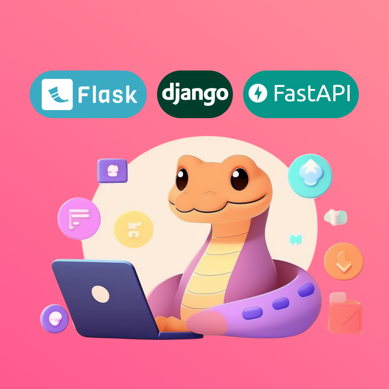
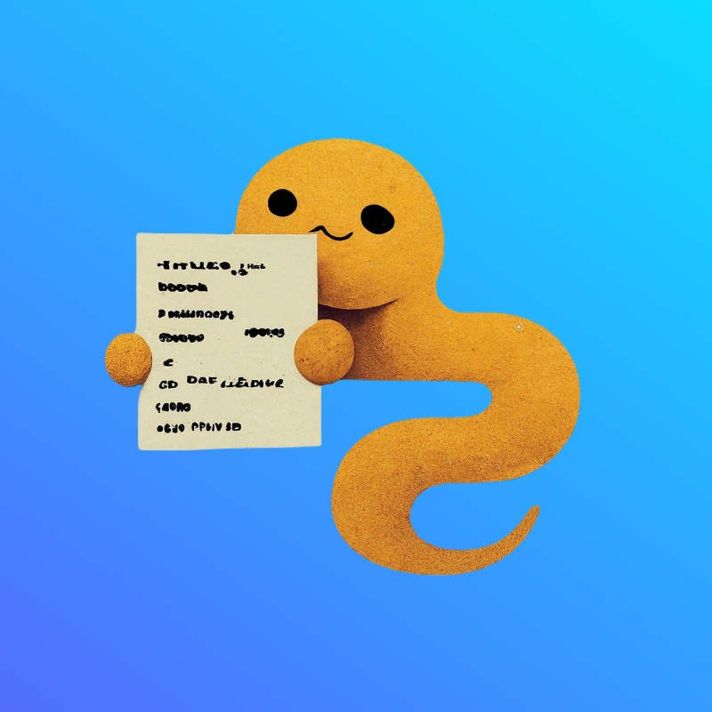

# Latest 

## Package Comparison

 
  

    <a class="title" href="../getting-started/package-comparison/django-fastapi-flask">
        <h2>Django vs FastAPI vs Flask</h2>
    </a>
    
A comprehensive guide on choosing the right python web framework

    

      <a href="../getting-started/package-comparison/django-fastapi-flask">Read more</a>
      📅 Jul 29, 2024
    

  

## Package Articles 

 
  

    <a class="title" href="../getting-started/package-articles/discord">
        <h2>Discord.py</h2>
    </a>
    
A Simplistic approach to creating your own Discord bot using Python.

    

      <a href="../getting-started/package-articles/discord">Read more</a>
      📅 Apr 04, 2023
    

  

 
  

    <a class="title" href="../getting-started/package-articles/asyncio">
        <h2>asyncio — Asynchronous I/O</h2>
    </a>
    
A comprehensive guide on how to work with asyncio.

    

      <a href="../getting-started/package-articles/asyncio">Read more</a>
      📅 Apr 01, 2024
    

  

## Python Basics

 
  

    <a class="title" href="../getting-started/python-basics/install-python">
        <h2>Installing Python on Windows</h2>
    </a>
    
A step-by-step guide on installing Python on Windows for beginners.

    

      <a href="../getting-started/python-basics/install-python">Read more</a>
      📅 Aug 01, 2023
    

  

 
  

    <a class="title" href="../getting-started/python-basics/install-packages">
        <h2>Installing Packages Using pip</h2>
    </a>
    
A guide on how to install Python packages using pip, the Python package manager.

    

      <a href="../getting-started/python-basics/install-packages">Read more</a>
      📅 Aug 01, 2023
    

  

## Cheatsheets 

 
  

    <a class="title" href="../cheatsheets/python-basics">
        <h2>Python Basics</h2>
    </a>
    
A Python cheatsheet covering variables, data types, control structures, functions, file operations, classes, exceptions handling, modules, and virtual environments, with concise explanations and examples for all skill levels.

    

      <a href="../cheatsheets/python-basics">Read more</a>
      📅 Apr 01, 2024
    

  

