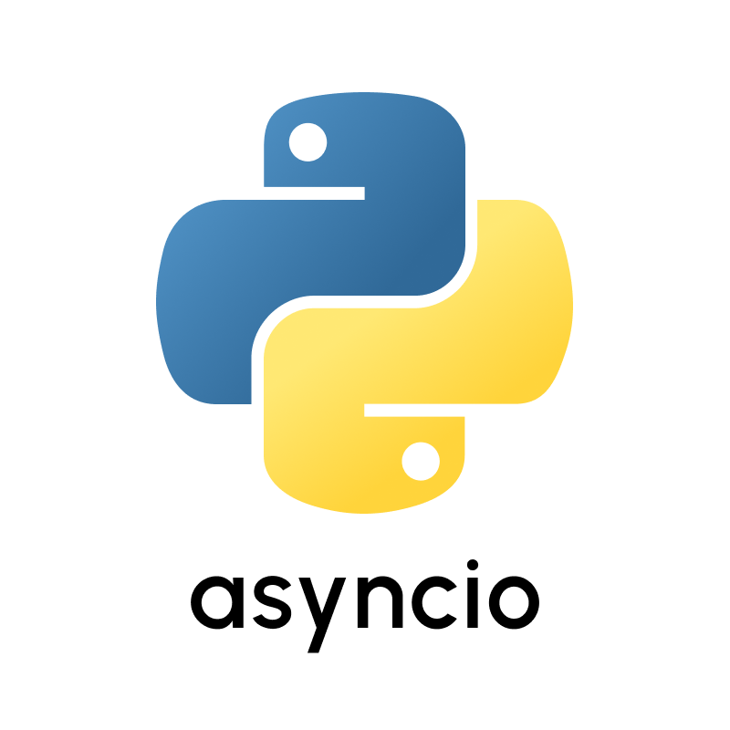

# Getting Started with Python and Python Packages

Whether you're a newcomer to Python or eager to explore the vast realm of Python packages, our guides are tailored to suit your needs. From foundational Python concepts to in-depth tutorials on popular packages spanning data science, web development, and more, we're your go-to resource for all things Python. Delve into our curated collection of beginner-friendly materials, gain insights from advanced topics, and join our vibrant community for support and collaboration. Start your Python journey today and unlock the full potential of this versatile programming language with Learn-pip-trends.

## Python Basics

If you're new to Python, it's essential to grasp the fundamentals. Our beginner-friendly guides cover everything from installing Python on your system to understanding basic syntax and data structures. Dive into Python programming with ease and start building your first projects.

### Latest Articles

 
  

    <a class="title" href="../getting-started/python-basics/install-python">
        <h2>Installing Python on Windows</h2>
    </a>
    
A step-by-step guide on installing Python on Windows for beginners.

    

      <a href="../getting-started/python-basics/install-python">Read more</a>
      📅 Aug 01, 2023
    

  

 
  

    <a class="title" href="../getting-started/python-basics/install-packages">
        <h2>Installing Packages Using pip</h2>
    </a>
    
A guide on how to install Python packages using pip, the Python package manager.

    

      <a href="../getting-started/python-basics/install-packages">Read more</a>
      📅 Aug 01, 2023
    

  

## Popular Python Packages

Discover the power of Python packages with our concise guides that cover essential tools and libraries for various tasks. From data analysis and machine learning to web development and automation, our articles provide step-by-step instructions on how to install, configure, and utilize popular Python packages. Whether you're a beginner looking to expand your skills or an experienced developer seeking new solutions, our resources will help you unlock the full potential of Python and enhance your programming projects.

### Latest Articles

 
  

    <a class="title" href="../getting-started/package-articles/discord">
        <h2>Discord.py</h2>
    </a>
    
A Simplistic approach to creating your own Discord bot using Python.

    

      <a href="../getting-started/package-articles/discord">Read more</a>
      📅 Apr 04, 2023
    

  

 
  

    <a class="title" href="../getting-started/package-articles/asyncio">
        <h2>asyncio — Asynchronous I/O</h2>
    </a>
    
A comprehensive guide on how to work with asyncio.

    

      <a href="../getting-started/package-articles/asyncio">Read more</a>
      📅 Apr 01, 2024
    

  

 
  

    <a class="title" href="../getting-started/package-articles/pymysql">
        <h2>PyMySQL</h2>
    </a>
    
A comprehensive guide on how to work with PyMySQL, a Python library to connect to the MySQL databases.

    

      <a href="../getting-started/package-articles/pymysql">Read more</a>
      📅 Jan 13, 2024
    

  

 
  

    <a class="title" href="../getting-started/package-articles/requests">
        <h2>requests</h2>
    </a>
    
A beginner's guide to Python's requests library, a powerful and user friendly tool for making HTTP requests.

    

      <a href="../getting-started/package-articles/requests">Read more</a>
      📅 Jan 08, 2024
    

  

 
  

    <a class="title" href="../getting-started/package-articles/matplotlib">
        <h2>matplotlib</h2>
    </a>
    
Explore the power of PyPlot, a module within matplotlib, for creating dynamic and visually appealing plots in Python.

    

      <a href="../getting-started/package-articles/matplotlib">Read more</a>
      📅 Dec 18, 2023
    

  

